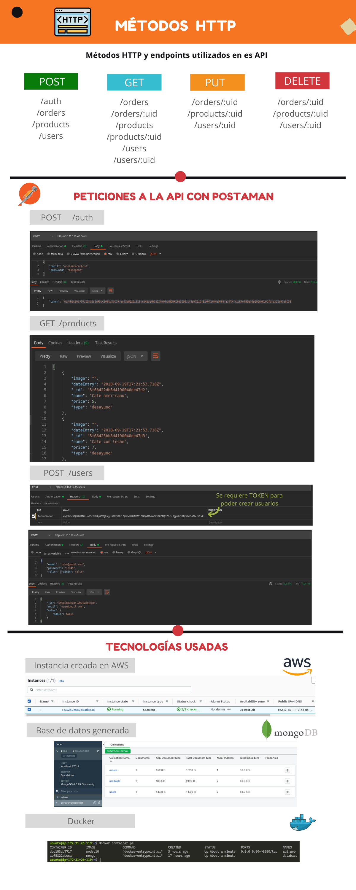

[](https://nodejs.org/es/)  

<p align="center">
  
</p>

## 1.Preámbulo

Un pequeño restaurante de hamburguesas, que está creciendo, necesita un sistema a través del cual puedan tomar pedidos usando una tablet, y enviarlos a la cocina para que se preparen ordenada y eficientemente.

Este proyecto tiene dos áreas: interfaz (cliente) y API (servidor). Nuestra clienta nos ha solicitado desarrollar la API que se debe integra con la interfaz, que otro equipo de desarrolladoras está trabajando simultáneamente.

## 2.Resumen del proyecto

Con una API en este caso nos referimos a un servidor web, que es básicamente un programa que escucha en un puerto de red, a través del cual podemos enviarle consultas (request) y obtener respuestas (response).

Un servidor web debe manejar consultas entrantes y producir respuestas a esas consultas que serán enviadas de vuelta al cliente. Cuando hablamos de aplicaciones de servidor, esto implica una arquitectura de cliente/servidor, donde el cliente es un programa que hace consultas a través de una red (por ejemplo el navegador, cURL, ...), y el servidor es el programa que recibe estas consultas y las responde.

Node.js nos permite crear servidores web super eficientes de manera relativamente simple y todo esto usando JavaScript!

En este proyecto partimos de un boilerplate que ya contiene una serie de endpoints (puntos de conexión o URLs) y nos piden completar la aplicación. Esto implica que tendremos que partir por leer la implementación existente, y familiarizarnos con el stack elegido (Node.js y Express) y complementarlo con un motor de bases de datos, el cual tu deberás elegir entre MongoDB y MySQL.

La clienta nos ha dado un [link]('https://laboratoria.github.io/burger-queen-api/') a la documentación que especifica el comportamiento esperado de la API que expondremos por HTTP. Ahí puedes encontrar todos los detalles de qué endpoints debe implementar la aplicación, qué parámetros esperan, qué deben responder, etc.

<p align="center">
  
</p>

---

### Variables de Entornos 
- ```PORT y DB_URL``` Se especifican y configuran en el archivo docker-compose.yml,  de no ser el puerto por defecto sus valores son ```PORT:8080``` y ```DB_URL:mongodb://localhost:27017/burguer-queen-test```

- ```JWT_SECRET, ADMIN_EMAIL y ADMIN_PASSWORD``` se especifican y configuran  el archivo ```secrets.env```, sus valores por defecto son ```JWT_SECRET: xxxxxxxx, ADMIN_EMAIL:admin@localhost y ADMIN_PASSWORD:changeme```.
  

## Deploymnet

Este proyecto se implemento para poder desplegarse en un servidor en la nube(VPS) y hacer uso de contenedores(Docker), por ello cuenta con un archivo docker-compose.yml en el cual se especifican los contenedores que se han de crear, los puertos que se utilizaran, variables de entorno, etc.  Todo esto con el objetivo de que esta aplicación pueda ser desplegada sin dificulta en cualquier entorno.
Para levantar la aplicación en el VPS simplement ejecutar el ```docker-compose up```.

- AWS: 
  - IPV4: http://3.131.119.45/
  - DNS: [ec2-3-131-119-45.us-east-2.compute.amazonaws.com](http://ec2-3-131-119-45.us-east-2.compute.amazonaws.com/)

### 🔗 Dependencias

> Tecnologías usadas para desarrollar este proyecto.

- [x] [mongodb](https://github.com/yeniferpaloma3773?tab=repositories)
- [x] [Npm](https://docs.npmjs.com/cli-documentation/)
- [x] [Node.js](https://nodejs.org/es/)
- [x] [Javascript](https://developer.mozilla.org/es/docs/Web/JavaScript)

---
